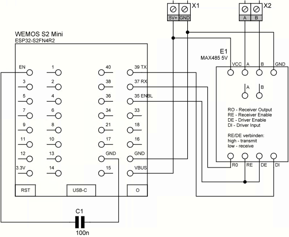
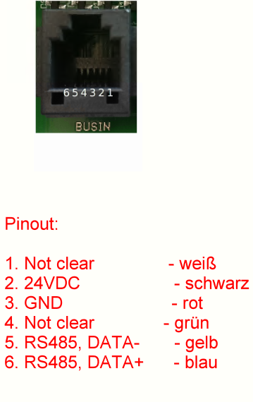
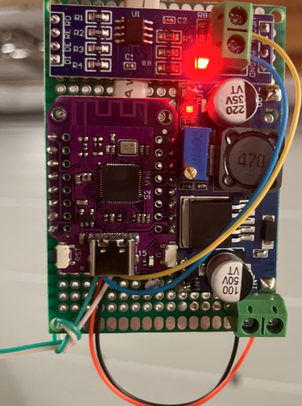
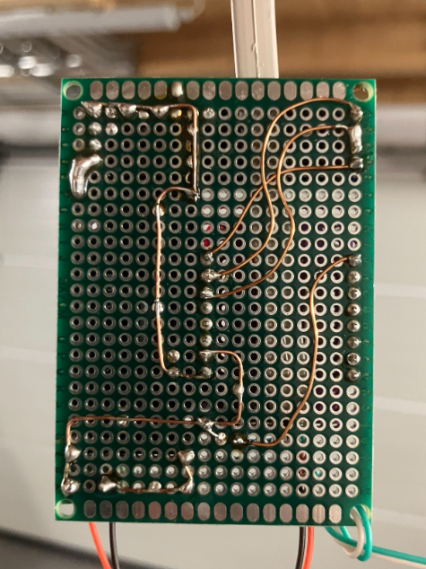

# hoermann-supramatic-e2-esphome
connect your old hörmann supramatic e2 with esphome to homeassistant

all credits to https://github.com/stephan192/hoermann_door

just some tweaks for e2 drive

*** hardware ***
MAX485
ESP32
Lm2596

6pin RJ12 cable

*** protocoll ***
00 00 01 02 CA -status
00 8C 02 01 80 AA - bus scan slave 8C
00 00 01 02 CA -status
00 8B 02 01 80 C8 - bus scan slave 8B

